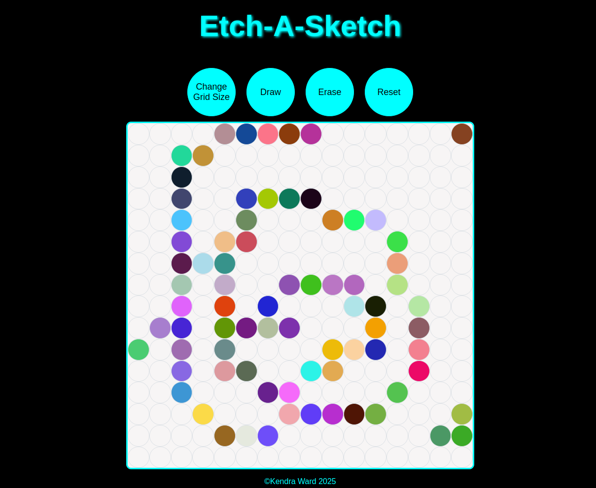

# Odin Project: Etch-A-Sketch

## About The Project

This project was created for the The Odin Project Foundations course. The task was to create a sketchpad that allows a user to change the size of the grid and "paint" by using their mouse to hover over the users desired area.

The overall task was to work on DOM manipulation skills and to follow assignment parameters:

- Create a webpage with a 16x16 grid of square divs.
  - Use Flexbox to make the divs appear as a grid (versus just one on each line).
- Set up a “hover” effect so that the grid divs change color when your mouse passes over them, leaving a (pixelated) trail through your grid like a pen would.
- Add a button on the top of the screen that will send the user a popup asking for the number of squares per side for the new grid. Once entered, the existing grid should be removed, and a new grid should be generated in the same total space as before (e.g., 960px wide) so that you’ve got a new sketch pad.

In addition to the button that prompts the user to change the grid size, I added 'Draw', 'Erase', and 'Reset' buttons.

- Reset - Sets the grid back to 16x16 divs.
- Erase - Sets the mouse to erase the random colors and change the background color of the divs back to white.
- Draw - Sets the mouse back to a "paint" stage where the hover action of the mouse generates the random color backgounds of each div.

I also chose to change the border radius of the div squares so they appear as circles instead of grid squares.

The project was not intended to be easy, in all it took me a little over a week to complete. Completing the project helped me to push outside of my comfort zone and to use new areas of JavaScript I never have. I would like to continue adding on to the project with different color options.

### Built With

- HTML
- CSS
- JavaScript

## Acknowledgements

- [W3 Schools](https://www.w3schools.com/)
- [Basic DOM Manipulation](https://developer.mozilla.org/en-US/docs/Learn_web_development/Core/Scripting/DOM_scripting#active_learning_basic_dom_manipulation)
- [JavaScript Mouse Events](https://www.javascripttutorial.net/javascript-dom/javascript-mouse-events/)

## Author

- Kendra Ward - [@KNWard](https://github.com/KNWard)
